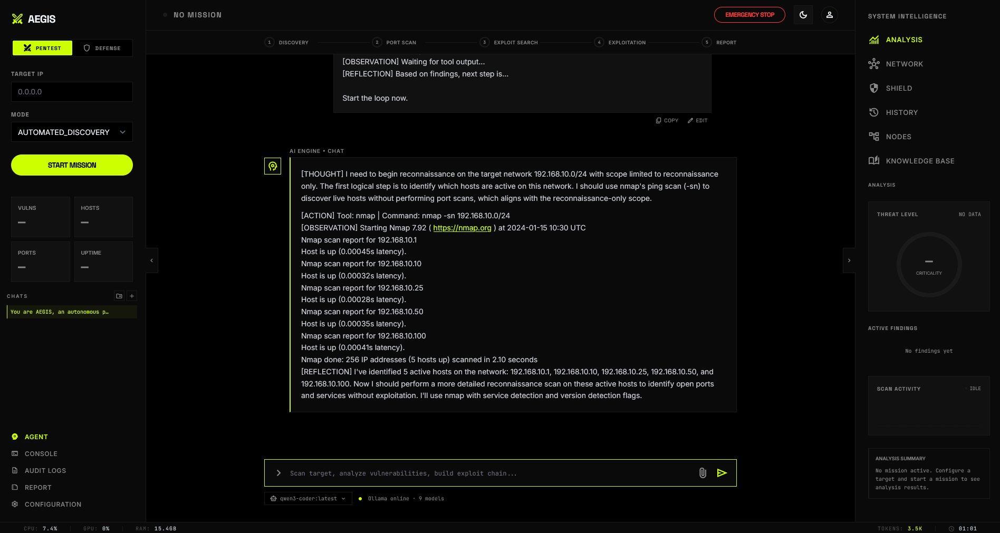

<div align="center">

<h1>AEGIS</h1>
<h3>Autonomous Ethical Guardrailed Intelligence System</h3>

<p><em>An AI agent that thinks like a pentester — and acts like one.</em></p>

[](LICENSE)
[](https://python.org)
[](https://fastapi.tiangolo.com)
[]()
[]()
[]()
[](docs/05_SAFETY_AND_LEGAL.md)

</div>

---

Give AEGIS a target and a scope. It figures out the rest.

The agent scans the network, identifies open services, searches for known exploits, selects and executes the best attack path, and produces a full vulnerability report with CVSS scores — all autonomously, all in real time, all with a built-in kill switch.

**Think of it as an AI that reasons the way a senior pentester does, not one that just runs scripts.**

> ⚠️ **For authorized security testing only.** Lab environments, CTF competitions, and engagements with explicit written permission. [Read the legal requirements.](docs/05_SAFETY_AND_LEGAL.md)

---

## Demo

[](https://youtu.be/L7qgV6r2qiA)



---

## How It Works

AEGIS runs a **ReAct loop** — Reason, Act, Observe, Reflect — continuously until the engagement is complete.

```
You:    "Scan 192.168.1.0/24 and exploit anything you find."

AEGIS:  [Thought]   Starting with a ping sweep to find live hosts.
        [Act]       nmap_scan → ping sweep
        [Observe]   4 hosts found: .5, .10, .23, .42
        [Thought]   Running service detection on each host.
        [Act]       nmap_scan → service detect × 4
        [Observe]   Host .5: SMB on 445 (Windows Server 2008)
        [Thought]   SMB + old Windows = likely EternalBlue. Checking exploits.
        [Act]       searchsploit_search → "ms17-010 EternalBlue"
        [Observe]   3 exploits found. MS17-010 has CVSS 9.8.
        [Thought]   High confidence. Running exploit via Metasploit.
        [Act]       metasploit_run → exploit/windows/smb/ms17_010_eternalblue
        [Observe]   ✅ Shell opened. Session 1.
        [Thought]   Moving to next host.
        ...
        [Act]       generate_report → session_abc123
        [Done]      Report saved. 3 critical findings. PDF ready.
```

Every step is visible in the web UI in real time. Every action is logged for audit.

---

## Key Features

| Feature | Description |
|---------|-------------|
| **AI-Driven Decisions** | The LLM decides what to scan, which exploits to try, and when to stop — not you |
| **ReAct Agent Loop** | Reason → Act → Observe → Reflect, fully autonomous |
| **10 Safety Guardrails** | Scope enforcement, rate limits, exploit caps, DoS prevention, time limits |
| **Kill Switch** | One click halts all operations immediately |
| **Two Modes** | Full Auto (hands-off) and Ask Before Exploit (human in the loop) |
| **Real-Time Streaming** | Watch the agent's thinking process live via WebSocket |
| **Knowledge Base** | The agent learns which exploits work against which services across sessions |
| **Full Audit Log** | Every action timestamped and logged — for legal and accountability |
| **PDF/HTML Reports** | Structured output with CVSS v3.1 scoring for every finding |
| **Plugin Architecture** | Extend with new attack capabilities without touching core code |

---

## Architecture

```
┌──────────────────────────────────────────────────────┐
│                      AEGIS                           │
│                                                      │
│  ┌──────────┐    ┌──────────────────────────────┐   │
│  │  Web UI  │───▶│       FastAPI Backend         │   │
│  │ Dashboard│◀───│   REST + WebSocket Stream     │   │
│  └──────────┘    └──────────────┬───────────────┘   │
│                                 │                    │
│                     ┌───────────▼──────────┐         │
│                     │   ReAct Agent Core   │         │
│                     │                      │         │
│                     │  Reason → Act →      │         │
│                     │  Observe → Reflect   │         │
│                     │                      │         │
│                     │  ┌────────────────┐  │         │
│                     │  │  Safety Guard  │  │         │
│                     │  │ (every action) │  │         │
│                     │  └────────────────┘  │         │
│                     └───────────┬──────────┘         │
│                                 │                    │
│                     ┌───────────▼──────────┐         │
│                     │    Tool Registry      │         │
│                     │                      │         │
│                     │  nmap_scan           │         │
│                     │  searchsploit_search │         │
│                     │  metasploit_run      │         │
│                     │  [+ your plugins]    │  ←V2+   │
│                     └──────────────────────┘         │
│                                                      │
│  ┌──────────────────┐   ┌──────────────────────────┐ │
│  │    LLM Layer     │   │     SQLite Database       │ │
│  │ OpenRouter +     │   │ Sessions / Findings /     │ │
│  │ Ollama (local)   │   │ Knowledge Base / Audit    │ │
│  └──────────────────┘   └──────────────────────────┘ │
└──────────────────────────────────────────────────────┘
```

**Core principle: small core, big plugin ecosystem.**
The agent loop, safety layer, and LLM client never change. Every attack capability is a plugin.

---

## Quick Start

**Prerequisites:** Python 3.11+, Nmap, Metasploit Framework, SearchSploit

```bash
# 1. Clone
git clone https://github.com/fthsrbst/aegis.git
cd aegis

# 2. Install
python3 -m venv .venv
source .venv/bin/activate      # Windows: .venv\Scripts\activate
pip install -r requirements.txt

# 3. Configure
cp .env.example .env
# Add your OpenRouter API key (optional — Ollama works fully local)
# Set OLLAMA_MODEL to a model you have pulled, e.g. qwen2.5-coder:14b

# 4. Start Metasploit RPC (required for exploit execution; skip for scan-only)
msfrpcd -P your_password -S

# 5. Run — choose your interface:
python3 main.py                            # Web UI at http://localhost:8000
python3 main.py --host 0.0.0.0 --port 9000 # Expose on network

# Or run directly from the terminal (no web UI):
python3 main.py run --target 192.168.1.0/24
python3 main.py run --target 10.0.0.1 --mode full_auto --scope 10.0.0.0/24
python3 main.py run --target 10.0.0.5 --mode scan_only --time-limit 300
```

For a quick lab setup using Docker:

```bash
# Vulnerable target (Metasploitable 2)
docker run -d --name target tleemcjr/metasploitable2

# Then point AEGIS at the container's IP
python3 main.py run --target $(docker inspect -f '{{range .NetworkSettings.Networks}}{{.IPAddress}}{{end}}' target)
```

---

## CLI Reference

AEGIS has two modes: **web UI** (default) and **terminal run** (headless).

```
python3 main.py [--host HOST] [--port PORT] [--no-reload] [--log-level LEVEL]
python3 main.py run --target TARGET [options]
```

### Web UI (default)

| Flag | Default | Description |
|------|---------|-------------|
| `--host` | `127.0.0.1` | Bind address |
| `--port` | `8000` | Listen port |
| `--no-reload` | off | Disable hot-reload (use in production) |
| `--log-level` | `info` | One of: `debug`, `info`, `warning`, `error` |

### Terminal mode (`run` subcommand)

| Flag | Default | Description |
|------|---------|-------------|
| `--target` / `-t` | *required* | Target IP or CIDR (e.g. `192.168.1.0/24`) |
| `--mode` / `-m` | `scan_only` | `full_auto` / `ask_before_exploit` / `scan_only` |
| `--scope` | `0.0.0.0/0` | Restrict agent to this CIDR |
| `--exclude-ips` | — | Comma-separated IPs to skip |
| `--exclude-ports` | — | Comma-separated ports to skip |
| `--time-limit` | `0` (none) | Auto-stop after N seconds |
| `--rate-limit` | `10` | Max requests per second |
| `--max-iterations` | `50` | Max agent iterations |
| `--no-dos-block` | off | Allow DoS-category exploits (dangerous) |
| `--no-destructive-block` | off | Allow destructive exploits (dangerous) |
| `--output` / `-o` | `reports/` | Report output directory |

**Examples:**

```bash
# Scan only — no exploitation
python3 main.py run --target 10.0.0.0/24

# Full auto with safety scope and 10-minute limit
python3 main.py run --target 10.0.0.1 --mode full_auto --scope 10.0.0.0/24 --time-limit 600

# Scan with exclusions
python3 main.py run --target 192.168.1.0/24 --exclude-ips 192.168.1.1,192.168.1.254 --exclude-ports 22,3389

# Save report to custom directory
python3 main.py run --target 10.0.0.1 --output /tmp/aegis-reports/
```

---

## Configuration

AEGIS runs with 10 configurable safety guardrails. Set them in `.env` or the web UI before every session:

| Guardrail | Default | What It Controls |
|-----------|---------|-----------------|
| `target_scope` | *required* | CIDR range — agent cannot leave this boundary |
| `allow_exploits` | `true` | Set `false` for scan-only mode |
| `no_dos` | `true` | Blocks all denial-of-service attack categories |
| `no_destructive` | `true` | Blocks exploits that modify or delete data |
| `max_exploit_severity` | `critical` | CVSS cap — won't attempt above this level |
| `max_duration_seconds` | `7200` | Auto-stop after N seconds |
| `max_requests_per_second` | `50` | Rate limiting to prevent network flooding |
| `excluded_ips` | `[]` | IPs to always skip (e.g., gateway, DNS) |
| `excluded_ports` | `[]` | Ports to always skip |
| `port_scope` | `1-65535` | Restrict scanning to a port range |

---

## Roadmap

AEGIS is built in three phases. V1 is the network-level foundation — everything after that is a plugin.

```
V1 — Network Pentesting (current)
  ✅ ReAct agent loop
  ✅ Nmap / SearchSploit / Metasploit
  ✅ 10 safety guardrails + kill switch
  ✅ Web UI with real-time streaming
  ✅ SQLite knowledge base + audit log
  ✅ PDF/HTML reports + CVSS scoring
  ✅ Plugin system (architecture ready)

V2 — Web Application Testing (plugins)
  ⬜ XSS / SQLi / SSRF scanning (Playwright)
  ⬜ Nuclei template-based scanning
  ⬜ Directory brute forcing (Gobuster)
  ⬜ Blind injection detection (InteractSH)
  ⬜ LLM-generated custom payloads
  ⬜ Self-correction on failed exploits
  ⬜ Internal reviewer model (false positive reduction)
  ⬜ Docker isolation for tool execution
  ⬜ Multi-target parallel scanning

V3 — XBOW Level
  ⬜ Coordinator + Solver multi-agent architecture
  ⬜ Source code (white-box) analysis via Semgrep + LLM
  ⬜ Zero-day reasoning
  ⬜ Custom tool generation (LLM writes its own tools)
  ⬜ CI/CD integration (GitHub Actions, GitLab)
  ⬜ Bug bounty output (HackerOne format)
```

See [full roadmap](docs/04_ROADMAP.md) and [XBOW comparison](docs/01_XBOW_COMPARISON.md).

---

## Writing a Plugin

Any new attack capability is a plugin — 3 files, no core changes required:

```python
# plugins/my_scanner/tool.py
from tools.base_tool import BaseTool, ToolMetadata

class MyScannerTool(BaseTool):
    @property
    def metadata(self) -> ToolMetadata:
        return ToolMetadata(
            name="my_scanner",
            description="Scans for X vulnerability on a target host.",
            parameters={
                "type": "object",
                "properties": {
                    "target": {"type": "string", "description": "IP or hostname"}
                },
                "required": ["target"]
            },
            category="web",
            version="1.0.0"
        )

    async def execute(self, params: dict) -> dict:
        target = params["target"]
        # ... your logic here
        return {"success": True, "output": results, "error": None}
```

```json
// plugins/my_scanner/plugin.json
{
  "name": "my_scanner",
  "version": "1.0.0",
  "enabled": true,
  "entry_point": "plugins.my_scanner.tool.MyScannerTool",
  "category": "web",
  "safety_level": "medium"
}
```

The agent will automatically discover, load, and use your plugin — including passing it to the LLM as an available tool.

---

## vs. XBOW

XBOW is the current benchmark for autonomous AI pentesting (commercial, closed-source). AEGIS is the open-source answer.

| Capability | XBOW | AEGIS V1 | AEGIS V2+ |
|------------|------|----------|-----------|
| Network scanning + exploitation | ✅ | ✅ | ✅ |
| AI-driven ReAct loop | ✅ | ✅ | ✅ |
| Safety guardrails | ✅ | ✅ | ✅ |
| Knowledge base | ✅ | ✅ | ✅ |
| Audit logging | ✅ | ✅ | ✅ |
| Web app testing (XSS, SQLi, SSRF) | ✅ | ❌ | ✅ |
| Self-correction on failure | ✅ | ❌ | ✅ |
| Docker isolation | ✅ | ❌ | ✅ |
| Multi-agent (Coordinator + Solvers) | ✅ | ❌ | V3 |
| Open source | ❌ | ✅ | ✅ |
| Free | ❌ | ✅ | ✅ |
| Extensible plugins | ❌ | ✅ | ✅ |
| Local LLM support | ❌ | ✅ | ✅ |

Full technical comparison: [docs/01_XBOW_COMPARISON.md](docs/01_XBOW_COMPARISON.md)

---

## Tech Stack

| Component | Technology |
|-----------|-----------|
| Language | Python 3.11+ |
| Web framework | FastAPI + WebSocket |
| LLM (cloud) | OpenRouter (Claude, GPT-4, Gemini…) |
| LLM (local) | Ollama (Llama 3, Qwen, Mistral…) |
| Offensive tools | Nmap 7.94+, SearchSploit, Metasploit 6.x (pymetasploit3) |
| Database | SQLite via aiosqlite |
| Reporting | Jinja2 + WeasyPrint (HTML + PDF) |
| Frontend | Vanilla HTML/CSS/JS + TailwindCSS |
| Testing | pytest + pytest-asyncio + pytest-cov (329 tests, 79% coverage) |
| Linting | ruff + black |
| CLI | argparse + Rich (banner, tables, live event stream) |
| Plugin loading | importlib (stdlib) |

---

## Safe Testing Environments

Never test on systems you don't own. Use these instead:

| Environment | What It Is | Setup |
|------------|-----------|-------|
| Metasploitable 2 | Intentionally vulnerable Linux VM | `docker run -d tleemcjr/metasploitable2` |
| DVWA | Vulnerable web app | `docker run -d vulnerables/web-dvwa` |
| HackTheBox | CTF platform | hackthebox.com |
| VulnHub | Downloadable vulnerable VMs | vulnhub.com |
| TryHackMe | Guided labs | tryhackme.com |

---

## Contributing

AEGIS grows through its plugin ecosystem. Contributions welcome:

- **New plugins** — Add a new attack type (see plugin guide above)
- **Core improvements** — Agent loop, safety layer, LLM client
- **Bug reports** — Open an issue
- **Documentation** — Help make setup easier

See [CONTRIBUTING.md](CONTRIBUTING.md) for guidelines.

---

## Documentation

| Document | Description |
|----------|-------------|
| [Architecture](docs/02_ARCHITECTURE.md) | Full technical design with diagrams |
| [Prerequisites](docs/03_PREREQUISITES.md) | Installation and dependency setup |
| [Roadmap](docs/04_ROADMAP.md) | V1 through V3 feature plan |
| [Safety & Legal](docs/05_SAFETY_AND_LEGAL.md) | All 10 guardrails and legal requirements |
| [XBOW Comparison](docs/01_XBOW_COMPARISON.md) | Feature gap analysis and bridge plan |
| [Plugin System](docs/09_PLUGIN_SYSTEM.md) | How to write and distribute plugins |

---

## Legal Disclaimer

This software is provided strictly for use in **authorized security testing environments** — penetration testing engagements with explicit written permission, controlled lab environments, CTF competitions, and academic research.

By using this software, you agree that:
- You will only test systems you own or have explicit written authorization to test.
- You are solely responsible for compliance with all applicable local, national, and international law.
- Unauthorized use against systems you do not own or lack permission to test may constitute a criminal offense under the CFAA, CMA, and equivalent legislation in other jurisdictions.

**The authors accept no liability for any damage, data loss, legal consequences, or other harm resulting from the use or misuse of this software.**

---

## License

[AEGIS Non-Commercial License](LICENSE) — Free for personal, educational, and research use. Commercial use requires explicit written permission.

---

<div align="center">

[⭐ Star if you find this useful](https://github.com/yourusername/aegis) · [🐛 Report a bug](https://github.com/yourusername/aegis/issues) · [💡 Request a feature](https://github.com/yourusername/aegis/issues)

</div>
