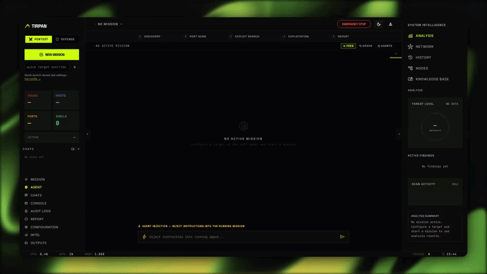

<div align="center">


# TIRPAN

**Targeted Intrusion Recon, Penetration & Autonomy Node**

*An AI agent that reasons like a senior penetration tester and executes like one.*

[](LICENSE)
[](https://python.org)
[](https://fastapi.tiangolo.com)
[]()
[]()
[]()
[](docs/05_SAFETY_AND_LEGAL.md)

**Read in another language:** [Türkçe](README.tr.md)

</div>

---

Give TIRPAN a target and a scope. It handles the rest.

The agent scans the network, enumerates services, searches for known exploits, selects and executes the best attack path, performs post-exploitation reconnaissance, and produces a structured vulnerability report with CVSS scores — all autonomously, all in real time, all with a built-in kill switch.

> **For authorized security testing only.** Lab environments, CTF competitions, and engagements with explicit written permission. [Read the legal requirements.](docs/05_SAFETY_AND_LEGAL.md)

---

## Demo

[](https://www.youtube.com/watch?v=t5nF3lujWJg)

---

## How It Works

TIRPAN runs a **ReAct loop** — Reason, Act, Observe, Reflect — continuously until the engagement is complete or all objectives are satisfied.

```
Operator:  "Scan 192.168.1.0/24, exploit what you find, collect post-exploitation data."

TIRPAN:     [Thought]   No hosts discovered yet. Starting ping sweep.
           [Act]       nmap_scan — ping sweep on 192.168.1.0/24
           [Observe]   4 live hosts: .5, .10, .23, .42
           [Thought]   Running full service detection on all hosts in parallel.
           [Act]       nmap_scan — service scan x4
           [Observe]   Host .5: SMB/445 (Windows Server 2008 R2), SSH/22, HTTP/80
           [Thought]   SMB on an old Windows host. Checking for EternalBlue.
           [Act]       searchsploit_search — "ms17-010"
           [Observe]   exploit/windows/smb/ms17_010_eternalblue — CVSS 9.8
           [Thought]   Critical severity, high confidence. Running exploit with post-commands.
           [Act]       metasploit_run — ms17_010_eternalblue + post_commands
           [Observe]   Shell opened. Session 1. whoami: NT AUTHORITY\SYSTEM
           [Thought]   Root shell on .5. Recording recon. Moving to next host.
           ...
           [Act]       generate_report
           [Done]      3 critical findings. HTML and PDF reports saved.
```

Every step is visible in the web UI in real time. Every action is logged for audit purposes.

---

## Current Capabilities

| Capability | Detail |
|------------|--------|
| Network discovery | Nmap + Masscan fast sweep + auto-targeting of local subnets |
| Service enumeration | Port/service/version detection, NSE scripts, SMB null session, Telnet, RSH |
| Exploit search | SearchSploit/ExploitDB queries per service/version, CVE knowledge base |
| Exploitation | Metasploit RPC, rsh, distcc, webdav, telnet, ssh helpers |
| Web application testing | WhatWeb, Nikto, Nuclei, ffuf, Gobuster, Arjun, sqlmap, WPScan, Commix |
| OSINT | theHarvester, subfinder, WHOIS, DNS enumeration (zone transfer) |
| Post-exploitation | SSH + bind/reverse/ssh shells, persistent session management, PTY support |
| Lateral movement | CrackMapExec/NXC + Impacket (psexec, secretsdump, kerberoast, wmiexec) |
| Credential attacks | Hydra brute-force, Hashcat + John the Ripper offline cracking |
| Reporting | HTML/PDF reports with CVSS v3.1 scoring, Jinja2 templates |
| Multi-agent (V2) | BrainAgent coordinator + 7 specialized agents (scanner, exploit, webapp, OSINT, post-exploit, lateral, reporting) |
| Shell persistence (V2) | ShellManager with heartbeat monitoring and auto-reconnect |
| Inter-agent messaging (V2) | Async pub/sub AgentMessageBus with 20 message types |
| Shared mission state (V2) | MissionContext (hosts, ports, vulns, creds, loot, attack graph) |
| Real-time UI | WebSocket streaming of agent reasoning, tool calls, and results |
| Attack graph | React/TypeScript attack graph canvas with compromise level visualization |
| Knowledge base | Per-service exploit success memory + full audit log (append-only) |
| Safety | 10 guardrails + 5 permission flags + never-scan list + kill switch |
| Defense module | Blue-team network monitor, detector engine, attacker profiler, deception tools |
| ML pipeline | XGBoost + scikit-learn exploit predictor, finding classifier, attack path model |
| LLM providers | OpenRouter, Ollama, LM Studio, OpenCode Go — runtime-switchable |
| Training data | LoRA-format JSONL capture for LLM fine-tuning |
| Plugin system | Python class, CLI wrapper, API wrapper — all auto-discovered |

**33 tools registered at runtime in `tools/`:** `nmap_scan`, `masscan_scan`, `searchsploit_search`, `metasploit_run`, `ssh_exec`, `shell_exec`, `local_exec`, `whatweb_scan`, `nikto_scan`, `nuclei_scan`, `ffuf_scan`, `gobuster_scan`, `arjun_scan`, `sqlmap_scan`, `wpscan_scan`, `commix_scan`, `crackmapexec_exec`, `impacket_exec`, `theHarvester_scan`, `subfinder_scan`, `whois_lookup`, `dns_enum`, `telnet_probe`, `rsh_exec`, `distcc_exec`, `webdav_put`, `smb_enum`, `hydra_brute`, `hashcat_crack`, `john_crack`, `ddos_test`, `generate_report`, `report_finding`

Use `GET /api/v1/tools/status` to see which are available in your environment.

---

## Architecture

```
+----------------------------------------------------------+
|                         TIRPAN                            |
|                                                          |
|  +----------+     +----------------------------------+   |
|  |  Web UI  |<--->|  FastAPI  —  REST + WebSocket    |   |
|  +----------+     +----------------+-----------------+   |
|                                    |                     |
|                       +------------v-----------+         |
|                       |    ReAct Agent Core    |         |
|                       |                        |         |
|                       |  Reason  ->  Act    -> |         |
|                       |  Observe ->  Reflect   |         |
|                       |                        |         |
|                       |   +----------------+   |         |
|                       |   |  Safety Guard  |   |         |
|                       |   | (every action) |   |         |
|                       |   +----------------+   |         |
|                       +------------+-----------+         |
|                                    |                     |
|                       +------------v-----------+         |
|                       |     Tool Registry      |         |
|                       |                        |         |
|                       |  nmap_scan             |         |
|                       |  searchsploit_search   |         |
|                       |  metasploit_run        |         |
|                       |  ssh_exec              |         |
|                       |  shell_exec            |         |
|                       |  [+ plugins]     V2+   |         |
|                       +------------------------+         |
|                                                          |
|  +---------------------+  +--------------------------+   |
|  |      LLM Layer      |  |     SQLite Database      |   |
|  |  OpenRouter + Ollama|  |  Sessions / Findings /   |   |
|  |  (cloud or local)   |  |  Knowledge Base / Audit  |   |
|  +---------------------+  +--------------------------+   |
+----------------------------------------------------------+
```

**Design principle: small core, large tool surface.**
The ReAct loop, safety layer, and LLM client are stable. Core + extended tools live in `tools/` and can be augmented with `plugins/`.

V2 adds a Brain agent, a mission context shared across agents, an async message bus, a persistent shell manager, and 7 specialized agents (scanner, exploit, webapp, OSINT, post-exploit, lateral, reporting). All running in parallel under Brain's coordination. See [docs/02_ARCHITECTURE.md](docs/02_ARCHITECTURE.md).

---

## Quick Start

**Prerequisites:** Python 3.11+, Nmap 7.94+, Metasploit Framework 6.x, SearchSploit

```bash
# Clone
git clone https://github.com/fthsrbst/tirpan.git
cd tirpan

# Install dependencies
python3 -m venv .venv
source .venv/bin/activate
pip install -r requirements.txt

# Configure
cp .env.example .env
# Set OPENROUTER_API_KEY for cloud LLM, or configure OLLAMA_MODEL for local inference

# Start Metasploit RPC (required for exploitation; scan-only mode can skip)
msfrpcd -P your_password -S

# Launch web UI (supports V1 and V2)
python3 main.py
# Open http://localhost:8000

# Or run headless from the terminal (V1 single-agent)
python3 main.py run --target 192.168.1.0/24 --mode full_auto --scope 192.168.1.0/24
```

**Quick lab setup with Docker:**

```bash
# Start a vulnerable target (Metasploitable 2)
docker run -d --name target tleemcjr/metasploitable2

# Point TIRPAN at it
python3 main.py run --target $(docker inspect -f '{{range .NetworkSettings.Networks}}{{.IPAddress}}{{end}}' target)
```

---

## CLI Reference

TIRPAN operates in two modes: **web UI** (default, supports V1 and V2) and **terminal** (V1 headless).

### Web UI

```bash
python3 main.py [--host HOST] [--port PORT] [--no-reload] [--log-level LEVEL]
```

| Flag | Default | Description |
|------|---------|-------------|
| `--host` | `127.0.0.1` | Bind address |
| `--port` | `8000` | Listen port |
| `--no-reload` | off | Disable hot-reload |
| `--log-level` | `info` | debug / info / warning / error |

### Terminal Mode

```bash
python3 main.py run --target TARGET [options]
```

| Flag | Default | Description |
|------|---------|-------------|
| `--target` / `-t` | required | IP, CIDR, hostname, or URL |
| `--mode` / `-m` | `scan_only` | `full_auto` / `ask_before_exploit` / `scan_only` |
| `--scope` | `0.0.0.0/0` | Hard CIDR boundary — agent cannot leave this range |
| `--exclude-ips` | — | Comma-separated IPs to skip entirely |
| `--exclude-ports` | — | Comma-separated ports to skip |
| `--time-limit` | `0` (none) | Auto-stop after N seconds |
| `--rate-limit` | `10` | Maximum requests per second |
| `--max-iterations` | `50` | Maximum agent decision cycles |
| `--no-dos-block` | off | Permit DoS-category exploits (dangerous) |
| `--no-destructive-block` | off | Permit destructive exploits (dangerous) |
| `--output` / `-o` | `reports/` | Report output directory |

**Examples:**

```bash
# Reconnaissance only — no exploitation
python3 main.py run --target 10.0.0.0/24

# Full engagement with scope enforcement and time limit
python3 main.py run --target 10.0.0.1 --mode full_auto --scope 10.0.0.0/24 --time-limit 3600

# Scan with exclusions
python3 main.py run --target 192.168.1.0/24 --exclude-ips 192.168.1.1,192.168.1.254 --exclude-ports 22,3389
```

---

## Safety Guardrails

TIRPAN enforces ten configurable safety constraints on every action. These cannot be bypassed by the LLM — they are evaluated in a separate layer before any tool executes.

| Guardrail | Default | Description |
|-----------|---------|-------------|
| `allowed_cidr` | `0.0.0.0/0` | CIDR boundary — agent cannot target IPs outside this range |
| `allow_exploit` | `true` | Set `false` for reconnaissance-only mode |
| `block_dos_exploits` | `true` | Blocks denial-of-service exploit categories |
| `block_destructive` | `true` | Blocks destructive modules (wipe/encrypt) |
| `max_cvss_score` | `10.0` | CVSS ceiling for exploit attempts |
| `session_max_seconds` | `0` | Auto-stop after N seconds (0 = unlimited) |
| `max_requests_per_second` | `50` | Rate limit to prevent network disruption |
| `excluded_ips` | `[]` | IPs that are always skipped |
| `excluded_ports` | `[]` | Ports that are always skipped |
| `allowed_port_min/max` | `1-65535` | Constrain scanning to a specific port range |

**Never-scan list:** A hard block list loaded from the DB plus per-session exclusions. Violations are logged as CRITICAL and always blocked.

---

## Mission Configuration

For structured engagements, TIRPAN accepts a `MissionBrief` configuration that controls scope, permissions, credentials, and objectives.

```json
{
  "target": "10.0.0.50",
  "mode": "full_auto",
  "target_type": "webapp",
  "speed_profile": "stealth",
  "objectives": ["find flag.txt", "dump /etc/shadow", "achieve root"],
  "known_tech": ["apache/2.4", "php/8.1"],
  "scope_notes": "Production system. Ports 80 and 443 only.",
  "allow_exploitation": true,
  "allow_post_exploitation": true,
  "allow_lateral_movement": false,
  "allow_persistence": false,
  "allow_credential_harvest": false,
  "allow_data_exfil": false,
  "excluded_targets": ["10.0.0.1", "10.0.0.254"]
}
```

**Speed profiles:**

| Profile | Nmap timing | Behavior |
|---------|-------------|----------|
| `stealth` | `-T1 --scan-delay 5s` | Slow, IDS-evasive, minimal log footprint |
| `normal` | `-T3` | Balanced, default for most engagements |
| `aggressive` | `-T5 --min-rate 5000` | Maximum speed, lab and CTF targets only |

**Credential types supported:** SSH (password or key), SMB/NTLM, SNMP, database (MySQL, PostgreSQL, MSSQL, MongoDB), HTTP (basic, digest, form, bearer token).

---

## Roadmap

TIRPAN is built in two phases. V1 is the network-level foundation, V2 adds multi-agent orchestration and extended capabilities.

### V1 — Network Pentesting (complete)

- ReAct agent loop (Reason, Act, Observe, Reflect)
- Nmap / SearchSploit / Metasploit integration
- Post-exploitation via SSH, bind shell, reverse shell, script execution
- 10 safety guardrails and kill switch
- Web UI with real-time streaming
- SQLite knowledge base and full audit log
- HTML and PDF reports with CVSS v3.1 scoring
- MissionBrief structured configuration
- Speed profiles: stealth / normal / aggressive
- Plugin architecture (infrastructure ready)

### V2 — Multi-Agent Attack Lifecycle (implemented)

**Passive Reconnaissance**
- OSINT: theHarvester, subfinder, amass, crt.sh certificate transparency, Shodan, WHOIS
- GitHub and source code secret scanning
- DNS zone transfer and subdomain enumeration

**Service Enumeration**
- SMB: enum4linux-ng, CrackMapExec (shares, users, password policy)
- LDAP / Active Directory: ldapsearch, ldapdomaindump
- SNMP, SMTP, Redis, MongoDB unauthenticated access
- DNS brute-force and zone transfers

**Web Application Testing**
- Technology fingerprinting: WhatWeb, WAF detection
- Directory and file discovery: Feroxbuster, ffuf, Gobuster
- Vulnerability scanning: Nuclei (9000+ templates), Nikto
- SQL injection: sqlmap (detection and exploitation)
- Cross-site scripting: Dalfox, XSStrike
- Command injection: Commix
- Server-side template injection: tplmap
- SSRF, XXE, LFI/RFI, file upload bypass, open redirect
- JWT attacks, GraphQL enumeration, OAuth misconfiguration
- HTTP request smuggling and deserialization vulnerabilities

**Active Directory Attacks**
- BloodHound-python collection
- Kerberoasting and AS-REP roasting via Impacket
- Pass-the-hash: CrackMapExec, evil-winrm
- DCSync: impacket-secretsdump

**Credential Attacks**
- Online brute-force: Hydra, Medusa
- Credential spraying with lockout guard
- Offline hash cracking: Hashcat, John the Ripper

**Post-Exploitation**
- Automated linpeas / winpeas upload and execution
- Custom code generation, upload, and execution on target (LLM-written payloads)
- Privilege escalation path analysis

**Lateral Movement**
- TCP tunneling: Chisel, Socat
- Impacket psexec / wmiexec
- Internal subnet discovery and pivot scanning

**CTF and Bug Bounty Modes**
- Automatic flag detection and capture (HTB, THM, CTFd)
- Bug bounty scope enforcement and out-of-scope blocking
- CVSS-filtered reporting for HackerOne / Bugcrowd submission templates

**Infrastructure**
- Tool health check system with install hints
- Plugin types: Python class, CLI wrapper, REST API wrapper (no code required for CLI and API plugins)
- Structured `Finding` model with evidence, reproduction steps, and remediation
- SARIF output for CI/CD and IDE integration
- Vector search knowledge base (RAG) using local embeddings

---

## Writing a Plugin

Plugins are optional add-ons. Core and extended tools live in `tools/`, while custom integrations can be added in `plugins/` without touching core code.

**Python class plugin** (complex logic):

```python
# plugins/my_tool/tool.py
from tools.base_tool import BaseTool, ToolMetadata

class MyTool(BaseTool):
    @property
    def metadata(self) -> ToolMetadata:
        return ToolMetadata(
            name="my_tool",
            description="Scans for X vulnerability.",
            parameters={
                "type": "object",
                "properties": {
                    "target": {"type": "string", "description": "IP or hostname"}
                },
                "required": ["target"]
            },
            category="recon",
            version="1.0.0"
        )

    async def execute(self, params: dict) -> dict:
        target = params["target"]
        # implementation
        return {"success": True, "output": results, "error": None}
```

**CLI wrapper plugin** (V2 — no Python required):

```json
{
  "name": "nuclei_scan",
  "type": "cli_wrapper",
  "binary": "nuclei",
  "install_hint": "go install github.com/projectdiscovery/nuclei/v3/cmd/nuclei@latest",
  "args_template": ["-u", "{target}", "-t", "{templates}", "-o", "{output_file}", "-json", "-silent"],
  "output_format": "jsonlines",
  "parameters": {
    "type": "object",
    "properties": {
      "target": {"type": "string"},
      "templates": {"type": "string", "default": "cves/"}
    },
    "required": ["target"]
  }
}
```

The agent discovers, loads, and uses plugins automatically — including exposing them to the LLM as available actions.

---

## Comparison with XBOW

XBOW is the current commercial benchmark for autonomous AI pentesting. TIRPAN is the open-source equivalent.

| Capability | XBOW | TIRPAN V1 | TIRPAN V2+ |
|------------|------|----------|-----------|
| Network scanning and exploitation | Yes | Yes | Yes |
| AI-driven ReAct loop | Yes | Yes | Yes |
| Safety guardrails | Yes | Yes | Yes |
| Cross-session knowledge base | Yes | Yes | Yes |
| Full audit logging | Yes | Yes | Yes |
| Web application testing | Yes | No | Yes |
| Active Directory attacks | Yes | No | Yes |
| OSINT and passive reconnaissance | Yes | No | Yes |
| Self-correction on failure | Yes | No | Yes |
| Docker-isolated tool execution | Yes | No | No |
| Multi-agent coordinator architecture | Yes | No | Yes |
| Open source | No | Yes | Yes |
| Free to use | No | Yes | Yes |
| Extensible plugin ecosystem | No | Yes | Yes |
| Local LLM support | No | Yes | Yes |
| ML-based exploit prediction | No | No | Yes |
| Network defense (blue team) | No | No | Yes |
| Attack graph visualization | Partial | Yes | Yes (React) |
| LoRA training data capture | No | No | Yes |

Full comparison: [docs/01_XBOW_COMPARISON.md](docs/01_XBOW_COMPARISON.md)

---

## Tech Stack

| Component | Technology |
|-----------|------------|
| Language | Python 3.11+ |
| Web framework | FastAPI 0.110+ with WebSocket streaming |
| LLM (cloud) | OpenRouter — Claude, GPT-4, Gemini, and others |
| LLM (cloud) | OpenCode Go — DeepSeek R1 and others |
| LLM (local) | Ollama — Llama 3, Qwen, Mistral, and others |
| LLM (local) | LM Studio — local inference server |
| Offensive tools | 33 tools: Nmap, Masscan, Metasploit, SearchSploit, Hydra, Hashcat, John, sqlmap, Nuclei, CrackMapExec, Impacket, and more |
| Database | SQLite via aiosqlite (async) |
| Reporting | Jinja2 + WeasyPrint (HTML and PDF) |
| Frontend | Vanilla HTML/CSS/JS + React/TypeScript attack graph canvas (Vite + Cytoscape.js + Tailwind) |
| ML | scikit-learn + XGBoost — exploit predictor, finding classifier, attack path model |
| Testing | pytest + pytest-asyncio + pytest-cov — 681 tests across 22 files |
| Linting | ruff + black |
| CLI | argparse + Rich |
| Plugin loading | importlib (stdlib) |
| Defense | Scapy-based sniffer, rule-based detectors, LLM-powered defense agent |
| Training data | LoRA-format JSONL capture for LLM fine-tuning (Qwen3 ChatML) |

---

## Safe Testing Environments

Never test on systems you do not own or have explicit written authorization to test. Use these instead:

| Environment | Description | Setup |
|-------------|-------------|-------|
| Metasploitable 2 | Intentionally vulnerable Linux VM | `docker run -d tleemcjr/metasploitable2` |
| DVWA | Vulnerable web application | `docker run -d vulnerables/web-dvwa` |
| HackTheBox | CTF and lab platform | hackthebox.com |
| VulnHub | Downloadable vulnerable VMs | vulnhub.com |
| TryHackMe | Guided learning labs | tryhackme.com |

---

## Documentation

| Document | Description |
|----------|-------------|
| [Architecture](docs/02_ARCHITECTURE.md) | Full system design with diagrams |
| [Prerequisites](docs/03_PREREQUISITES.md) | Installation and dependency setup |
| [Roadmap](docs/04_ROADMAP.md) | Completed and planned feature plan |
| [Safety and Legal](docs/05_SAFETY_AND_LEGAL.md) | All 10 guardrails and legal requirements |
| [XBOW Comparison](docs/01_XBOW_COMPARISON.md) | Feature gap analysis |
| [Plugin System](docs/09_PLUGIN_SYSTEM.md) | Plugin authoring guide |
| [Multi-Agent Spec](docs/11_MULTI_AGENT_SPEC.md) | V2 multi-agent architecture |
| [Defense Module](docs/07_NETWORK_DEFENSE_MODULE.md) | Blue team defense architecture |
| [Lab Environment](docs/12_LAB_ENVIRONMENT.md) | VM-based practice lab setup |
| [Master Checklist](docs/08_MASTER_CHECKLIST.md) | Detailed implementation progress |
| [Learning Roadmap](docs/10_LEARNING_ROADMAP.md) | Skill progression for developers |

---

## Contributing

TIRPAN grows through its plugin ecosystem. Contributions are welcome:

- **New plugins** — Add a new attack type following the plugin guide
- **Core improvements** — Agent loop, safety layer, LLM client
- **Bug reports** — Open an issue on GitHub
- **Documentation** — Improve setup guides and examples

See [CONTRIBUTING.md](CONTRIBUTING.md) for guidelines.

---

## Legal Disclaimer

This software is provided strictly for use in **authorized security testing environments** — penetration testing engagements with explicit written permission, controlled lab environments, CTF competitions, and academic research.

By using this software, you agree that:

- You will only test systems you own or have explicit written authorization to test.
- You are solely responsible for compliance with all applicable local, national, and international law.
- Unauthorized use against systems you do not own or lack explicit permission to test may constitute a criminal offense under the CFAA, Computer Misuse Act, and equivalent legislation in other jurisdictions.

**The authors accept no liability for any damage, data loss, legal consequences, or other harm resulting from the use or misuse of this software.**

---

## License

[TIRPAN Non-Commercial License](LICENSE) — Free for personal, educational, and research use. Commercial use requires explicit written permission from the authors.

---

<div align="center">

[Star this repository](https://github.com/fthsrbst/tirpan) · [Report a bug](https://github.com/fthsrbst/tirpan/issues) · [Request a feature](https://github.com/fthsrbst/tirpan/issues)

</div>
